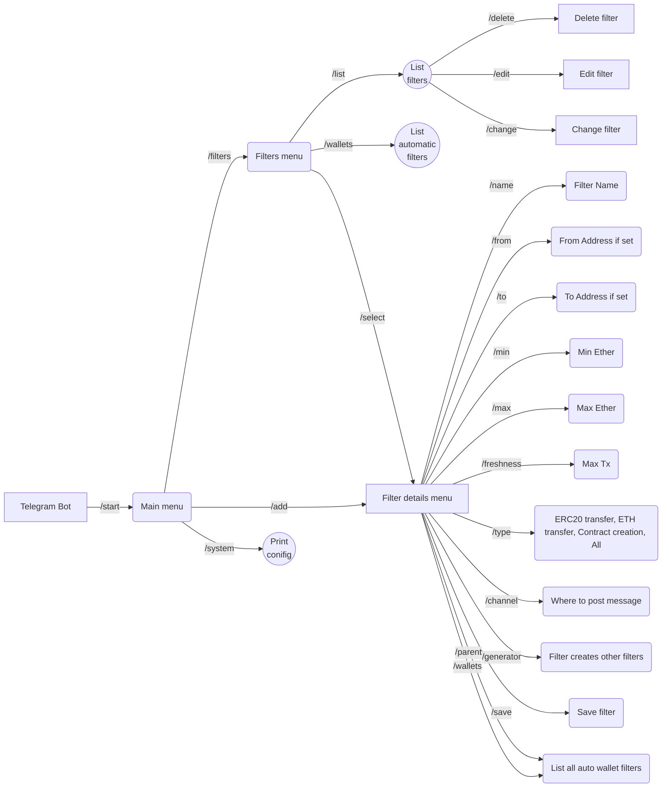
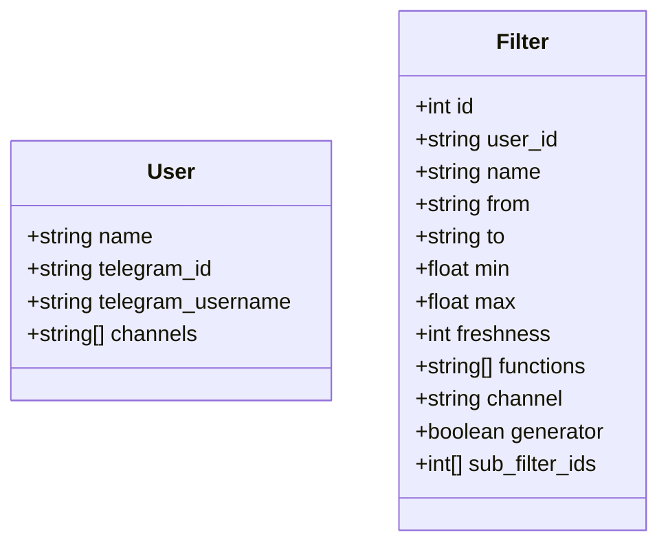

# telegram-ethereum-informer

- Filter transactions by from/to address, min/max amount, freshness of a counterparty
- Add/remove filters
- Automatically name new wallets found using the filter for example: (filter used "Binance" would name the new tracked
  wallet Binance 1 and the next would be Binance 2 etc... (This should be able to monitor a large number of wallets)
- For the newly tracked wallets e.g Binance 1, Binance 2 Create a filter to only show the transactions for trading and
  creating new token contracts (This is to filter out the useless transactions such as transfers)
- Create an easily readible system to display the messages.
- When a token is bought by one of the now "tracked" wallets display the contract adress of the token bought in the
  first line for example, (Binance 1 bought x eth of PEPE(token contract), transaction id)
- When a token contract is created by one of the "tracked" wallets display the token contract created in the first line
  for example, (Binance 1 created token contract PEPE(Token contract))
- Within the telegram bot create a command that shows all the tracked wallets, add an option to add/remove wallets from
  this list.
- For each filter be able to turn on/off the ability to automatically name/track the wallets (some wallets would be good
  to just see the funding transaction / sent to transaction so this functionality must be able to be toggled on/off)

## Plan

- Adding connection to the node and writing asyncrounous listeners/data fetchers - about half a day, 4hr
- Data structures and collections for discovered wallets and other operational data - 4 hr
- Piping data collections,- starting an automated listeners once a new wallets are discovered or added manually - 2 hr
- New filters and detection of the funding transaction or new contract tx - 1 hr
- Adding, removing, renaming wallets, new commands and overal update of the tg interface - 2 hr
- Setting up new bot, new repository, tg channel, building and deploying it there on the win machine separately - 1hr
  them.

## Architecture

```shell
├───main.py # main entry point and bot initialization
├───state.py # config file with bot token and other settings
├───telegram_bot.py # telegram bot interface
├───ethereum_listener.py # ethereum node connection and data fetchers
├───all_filters.py # telegram bot filters
├───database.py # SQLite database connection and data fetchers
├───utils.py # utility functions
```

## User interface



## Data Struct


